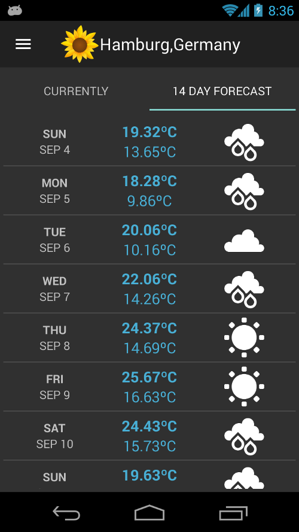
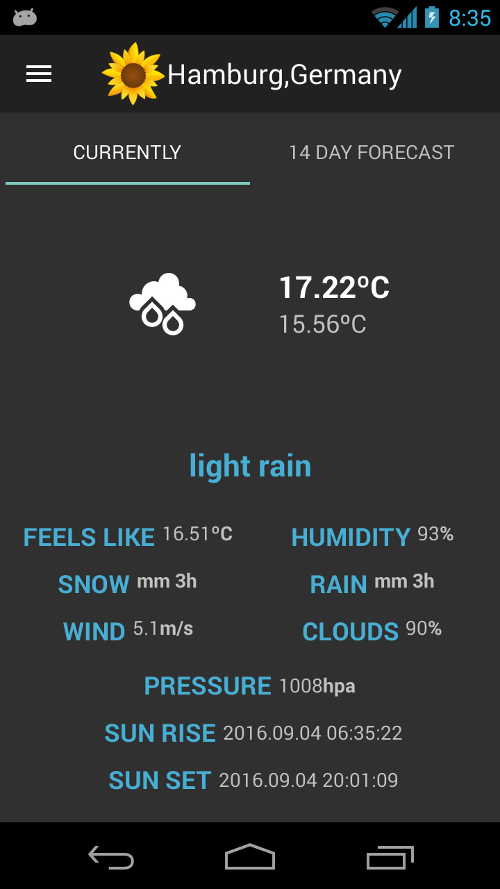
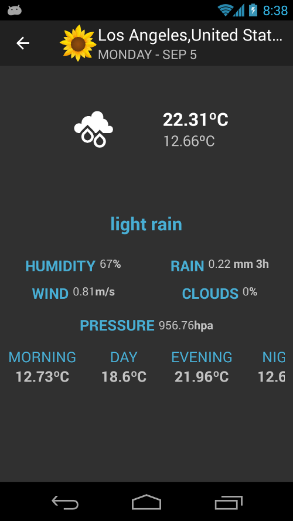
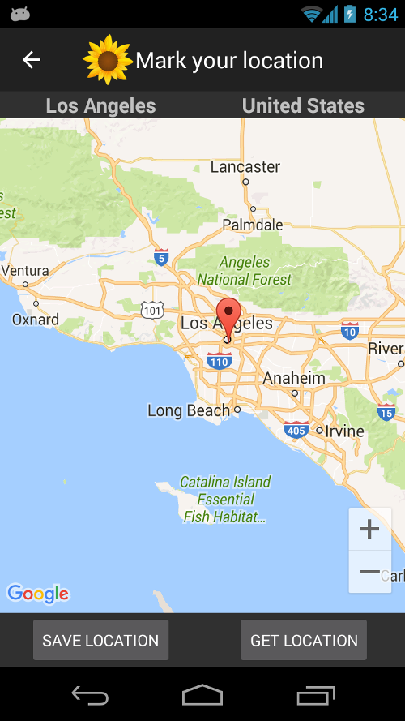
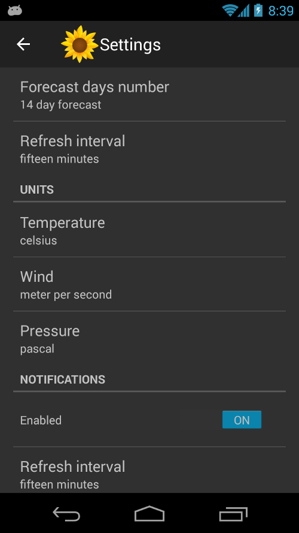
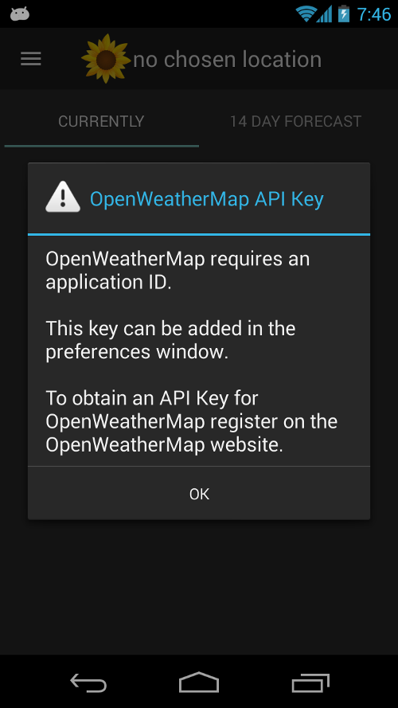
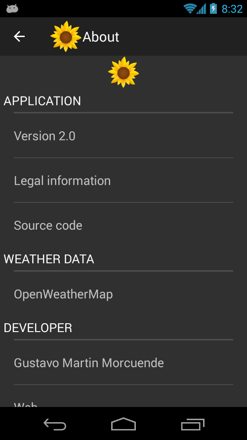

Weather Information
=========================

  

Weather Information is a simple and made for fun Android application for displaying current weather conditions and weather forecast worldwide. It implements a simple and clear user interface by means of default Android layouts and libraries.

Features:
 * One widget displaying the current weather conditions is available for the home and lock screens (widget updates weather data once every 60 minutes)
 * Turn on location access on your device and Weather Information will be able to find out your current location.
 * Notifications for the current weather conditions can be turned on and off.
 * You can change the units of measurement for the weather data in the preferences window.
 * Weather Information allows you to modify the refresh interval for the displayed data and the notifications (depending on your cell phone plan you might want to increase or decrease the refresh interval in order to save money)
 * Until fourteen days forecast.
 * No ads, this application is completely for free.
 * Weather Information is an open source application, what means, you can download and modify the source code (Apache License, Version 2.0). Indeed, we encourage you to do it.

Weather data are provided by [**OpenWeatherMap**](http://openweathermap.org/). OpenWeatherMap developers recommend to obtain an [API key](http://openweathermap.org/appid), this key can be added in the preferences window of the application. There are different [prices](http://openweathermap.org/price) (from free to enterprise) depending on the availability and reliability of the weather data. It is up to you which one to use.

**If you have an API key, be careful when using this application in public networks because anyone connected to your network could see your private API key** (Weather Information is using plain HTTP connections for retrieving data from OpenWeatherMap servers)

**Internationalization**: currently, Weather Information just displays weather data in English format. Because it is an open source application you can add as many languages as you wish just downloading the source code (you can collaborate to improve this application, if you wish)

## Forecast

Choose how many days of forecast you want to be displayed (fourteen days by default). Weather Information also shows you the maximum and minimum temperatures for the displayed days with a nice representation of the weather conditions for each one.

## Current conditions

Weather Information is able to display the current weather conditions: the maximum and minimum temperatures, humidity, wind, rain, pressure and many other data. In the preferences window you can modify the units of measurement for almost every data (choose whatever you like)

## Weather forecast for some day

In the forecast window, just select one day and Weather Information will provide you with more information about the chosen one.

## Pick your location

Using the map included in this application you can mark your chosen location in an easy way. If location access is available just press the *Get Location* button and Weather Information will pick your current location for you.

## Preferences

There are many settings that can be changed in the preferences window: units of measurement, refresh intervals, enable or disable notifications, your OpenWeatherMap [API key](http://openweathermap.org/appid) and many others.

## Widget

Just a simple widget with the current weather conditions. You can use it for the home and lock screens.

## Widget preferences

Weather Information allows you to change a couple of parameters of your widget: you can decide whether to show the country field or not and the units of measurement can also be changed.

Besides, instead of waiting for the automatic refresh (for the widget it is every 60 minutes) you can press the *Refresh* button and the displayed weather data will be updated.

## Notifications

From the settings window you can enable or disable notifications. When notifications are turned on, Weather Information will try to retrieve current weather data from the OpenWeatherMap servers. You can choose the refresh interval in the preferences window.

## Notice about missing OpenWeatherMap application ID

Even if OpenWeatherMap can work without it, the OpenWeatherMap maintainers recommend to use an [API key](http://openweathermap.org/appid). Weather Information will show you a warning message when you do not have an API key. If you do not want to be bothered again with this message, just press the *OK* button and the warning popup will be dismissed forever.

## About

Go to the about window if you want to learn more about the developers behind this application. Also, you will find third party files and libraries that are used by this application and their respective licenses.

